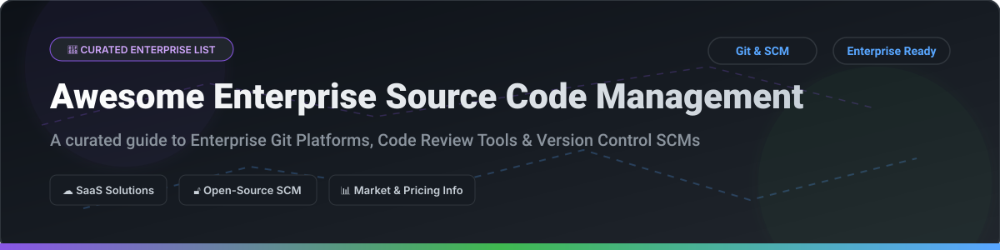

  

# 🚀 Awesome Enterprise Source Code Management 🛠️

  
  
  
  
  

> **Curated List of SaaS Products & Open-Source GitHub Projects**
> *Focused on Git Hosting, Version Control Systems (VCS), Code Review, CI/CD Integration & Enterprise Repository Management.*
> **Last updated: October 2026**

---

## 💡 Overview & SEO Highlights 🔎
Welcome to the definitive guide for **Enterprise Source Code Management (SCM)**, **Git Version Control**, and **Collaborative Code Review Platforms**. Whether you are looking for managed SaaS cloud solutions or production-proven self-hosted open-source version control software, this list compiles verified pricing, free tier capabilities, market valuation metrics, and GitHub star ratings to help DevOps engineers, infrastructure architects, and CTOs choose the right platform.

---

## 📖 Table of Contents 📑

- [☁️ SaaS/Hosted Platforms](#️-saashosted-platforms)
- [🔓 Open-Source GitHub Projects](#-open-source-github-projects)
- [🤝 How to Contribute](#-how-to-contribute)
- [💖 Support & Sponsorship](#-support--sponsorship)
- [⭐ Star History](#-star-history)
- [⚠️ Disclaimer](#️-disclaimer)

---

## ☁️ SaaS/Hosted Platforms 🌐

> **📊 Market Context & Industry Dynamics**: The global source code management market is estimated at **~$5.2B in 2026**, growing toward **~$12.5B by 2032** at a ~13.5% CAGR. The sector is **moderately concentrated** — market leaders **GitHub** and **GitLab** command the majority share of cloud-hosted Git workflows, while specialized enterprise systems like **Perforce Helix Core** and **Bitbucket Data Center** maintain strongholds in game development, semiconductor engineering, and Atlassian-centric enterprise environments. No single vendor holds a winner-take-all monopoly, as multi-vcs enterprise setups remain common.

Below is a breakdown of enterprise SaaS platforms sorted in **descending order by company size (Revenue / Valuation)**:

| Platform 🏢 | Description 📝 | Starting Tier Pricing 💰 | Free Tier Limits 🎁 | Company Size (Rev / Valuation) 📈 |
|:---|:---|:---|:---|:---|
| **[AWS CodeCommit](https://aws.amazon.com/codecommit/)** | **Managed Git repository service on AWS.** *(Notice: Discontinued for new accounts in July 2024; supported for existing users)*. | **$1.00 per active user/month** (beyond free tier) + $0.06/GB storage. | **5 free active users/month indefinitely**, 50 GB storage, and 10,000 Git requests/month. | **~$638B revenue (Amazon FY2025)** |
| **[GitHub Enterprise](https://github.com/enterprise)** | **Dominant enterprise Git SCM platform.** Includes GitHub Actions CI/CD, Advanced Security, and Copilot AI integrations. | **$21.00 per user/month** (Enterprise Cloud starting tier). | **30-day free trial** for Enterprise Cloud. Free perpetual plan for public repos with basic features. | **~$331.8B revenue (Microsoft FY2025)** |
| **[Azure Repos](https://azure.microsoft.com/en-us/products/devops/repos/)** | **Microsoft Azure DevOps Git & TFVC hosting.** Unlimited cloud Git repos with deep Azure Pipelines & Boards integration. | **$6.00 per user/month** (Basic plan, starting at user 6). | **First 5 users 100% free indefinitely**, includes 2 GB Azure Artifacts & 1 free parallel CI job. | **~$281.0B revenue (Microsoft FY2025)** |
| **[Bitbucket Data Center](https://www.atlassian.com/software/bitbucket/enterprise)** | **Atlassian enterprise Git repository manager.** Enterprise code security with native Jira and Confluence integration. | **$1,800.00 / year** (minimum tier entry for 11–25 users). | **Free plan for up to 5 users** with unlimited private repositories & 500 build mins/month. | **~$4.0B revenue (Atlassian FY2025)** |
| **[Plastic SCM](https://www.plasticscm.com/)** | **Version control tailored for game development & large binary assets.** High-performance monorepo management (Unity DevOps). | **$7.00 per user/month** (Cloud plan for 4+ team members). | **1–3 users free indefinitely** with 5 GB included cloud storage. | **~$2.0B revenue (Unity Software FY2025)** |
| **[GitLab Enterprise](https://about.gitlab.com/)** | **Complete AI-powered DevSecOps platform.** Enterprise Edition features compliance management, security scanning, and SCM. | **$29.00 per user/month** (GitLab Premium, billed annually at $348/yr). | **Free plan for up to 5 users per group** on GitLab.com + 30-day trial of Ultimate/Premium. | **~$955M revenue (GitLab FY2026)** |
| **[Perforce Helix Core (P4)](https://www.perforce.com/)** | **Industrial-strength SCM for enterprise binary assets, digital media, and massive monorepos.** | **$39.00 per user/month** (P4 Cloud starting tier). | **Free for up to 5 users** self-hosted with complete Helix Core features. | **~$500M+ revenue (Perforce Software est.)** |
| **[RhodeCode Enterprise](https://rhodecode.com/)** | **Enterprise source code management with unified control for Git, Subversion (SVN), and Mercurial (Hg).** | **$75.00 per user/year** (Enterprise tier, minimum 10 user pack). | **30-day full-featured free trial**. (Community Edition is free open-source). | **~$15M revenue (RhodeCode Inc est.)** |
| **[Gitea Enterprise](https://about.gitea.com/)** | **Commercial enterprise version of Gitea.** Provides priority L3 support, high-availability clusters, and SLA backing. | **$9.50 per user/month** (Annual promo commitment) or $19/mo standard. | **30-day free enterprise trial**. (Community Edition Gitea is 100% free open-source). | **~$10M valuation (Gitea / TechKnowlogick est.)** |

---

## 🔓 Open-Source GitHub Projects ⚡

The open-source SCM landscape is mature and battle-tested. Below are leading open-source Git server and version control software repos, sorted in **descending order by GitHub Star Count**:

| Repo 📦 | Description 📝 | Stars 🌟 |
|:---|:---|:---:|
| **[Gitea](https://github.com/go-gitea/gitea)** | **Painless self-hosted Git service.** Ultra-lightweight, fast, written in Go. Includes issue tracking, wiki, and code review. **MIT License**. |  |
| **[Gogs](https://github.com/gogs/gogs)** | **A painless, self-hosted Git service.** Extremely low system requirements; runs on Raspberry Pi. Written in Go. **MIT License**. |  |
| **[GitLab Community Edition](https://github.com/gitlabhq/gitlabhq)** | **Open-source DevOps & Git management platform.** Core web framework for self-hosted DevOps pipelines. **MIT License**. |  |
| **[Phabricator](https://github.com/phacility/phabricator)** | **Open-source suite of web tools for code review (Differential), repository hosting (Diffusion), and task management.** **Apache-2.0**. |  |
| **[GitBucket](https://github.com/gitbucket/gitbucket)** | **A JVM-based GitHub clone powered by Scala.** Easy setup via single WAR file with plugins support. **Apache-2.0**. |  |
| **[Forgejo](https://github.com/forgejo/forgejo)** | **Independent community-governed fork of Gitea** dedicated to software freedom and open governance under Codeberg. **GPL-3.0**. |  |
| **[OneDev](https://github.com/theonedev/onedev)** | **All-in-one DevOps platform featuring Git server, Docker-native CI/CD engine, and visual issue tracking.** **MIT License**. |  |
| **[Gerrit](https://github.com/GerritCodeReview/gerrit)** | **Web-based Git code review system** powering major projects like Android, Chromium, and Eclipse. **Apache-2.0**. |  |
| **[Kallithea](https://github.com/kallithea/kallithea)** | **Member project of Software Freedom Conservancy.** Supports Git & Mercurial repositories with built-in code review. **GPL-3.0**. |  |
| **[RhodeCode CE](https://github.com/rhodecode/rhodecode-enterprise-ce)** | **Community Edition of RhodeCode.** Unified management for Git, Mercurial (Hg), and Subversion (SVN). **AGPL-3.0**. |  |
| **[Fossil Mirror](https://github.com/drhsqlite/fossil-mirror)** | **Distributed SCM with integrated bug tracking, wiki, chat, and forum.** Created by the author of SQLite. **BSD-2-Clause**. |  |
| **[Gitolite](https://github.com/sitaramc/gitolite)** | **Access control layer on top of Git.** Provides fine-grained access control for enterprise Git servers. **GPL-2.0**. |  |
| **[Soft Serve](https://github.com/charmbracelet/soft-serve)** | **A TUI-driven command-line readable Git server** designed for terminal-first developers by Charm. **MIT License**. |  |

---

## 🤝 How to Contribute 🛠️

Contributions are welcome! To add a new enterprise SCM tool or open-source repository:

1. **Fork** this repository.
2. **Create a new branch** (`git checkout -b feature/add-scm-tool`).
3. **Add the entry** following the tabular format above (ensure pricing, free tier, company size, or star badge are included).
4. **Commit your changes** and submit a **Pull Request**.

---

## 💖 Support & Sponsorship ☕

If you found this list helpful for your enterprise architecture evaluation or open-source research, please consider giving it a ⭐ **Star**, sharing it with your team, or sponsoring the author!

  

- 🌟 **Star the Repo**: Help others discover this list.
- 📢 **Share**: Post on LinkedIn, Twitter/X, or your engineering blog.
- ☕ **Buy Me a Coffee**: Support ongoing updates via [GitHub Sponsors](https://github.com/sponsors/ishandutta2007).

---

## ⭐ Star History 📈

---

## ⚠️ Disclaimer 🔒

- This list is **community-curated** for informational and educational purposes.
- All SaaS pricing models, free tier limits, and corporate revenue metrics are verified as of **October 2026** but remain subject to change by vendors.
- Check out the main [Awesome List Meta-Repository](https://github.com/ishandutta2007/Awesome-Awesome-Awesome) for more curated software development resources.

---

  <i>Made with ❤️ for DevOps Engineers, SREs, Systems Architects, and Engineering Directors worldwide.</i>

